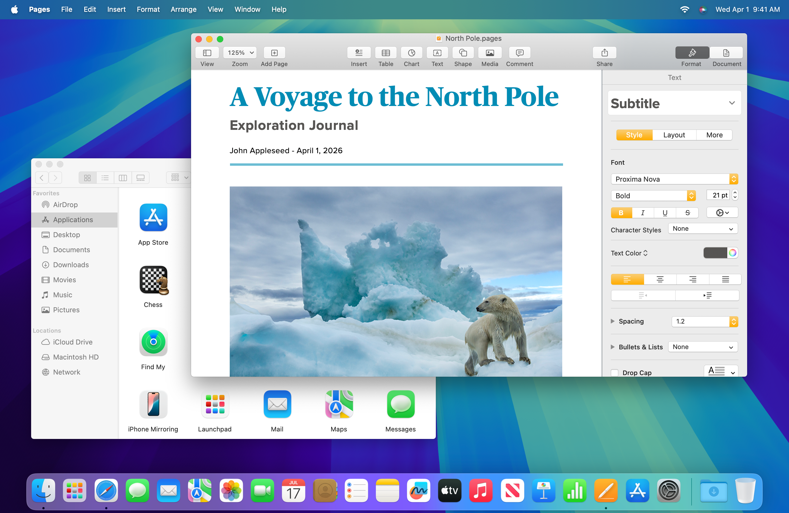
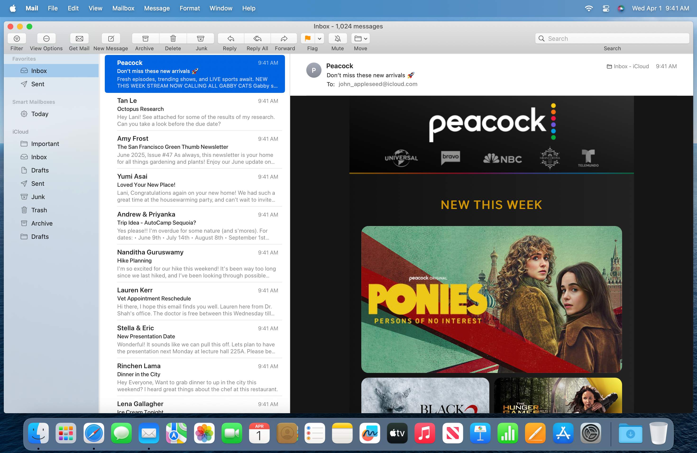
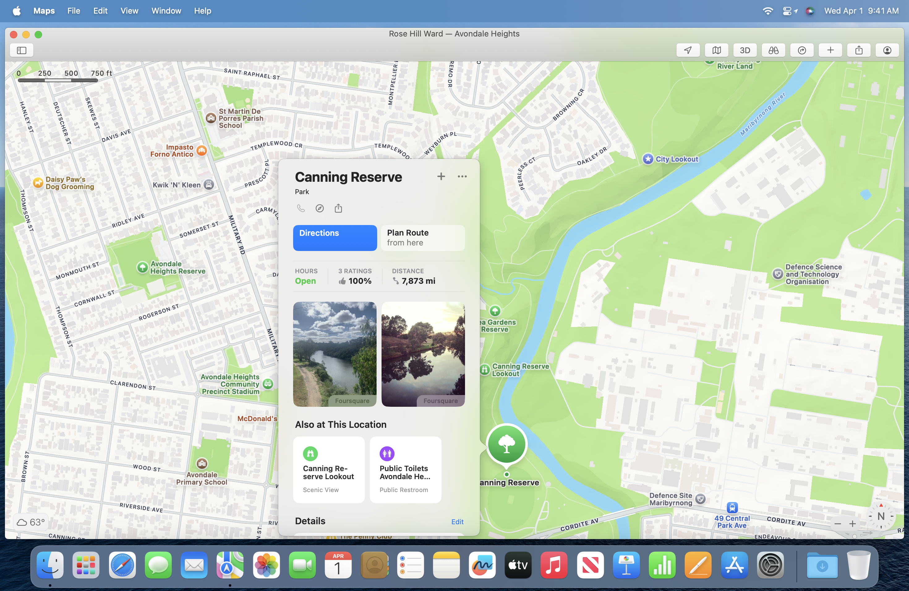
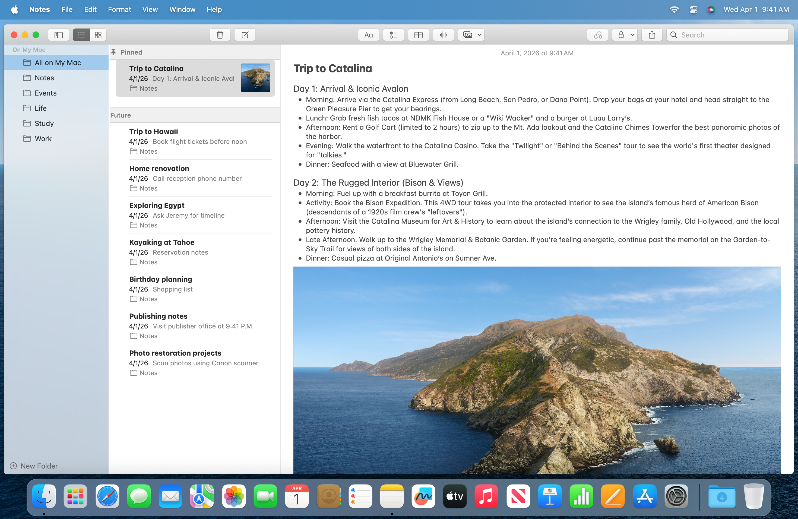
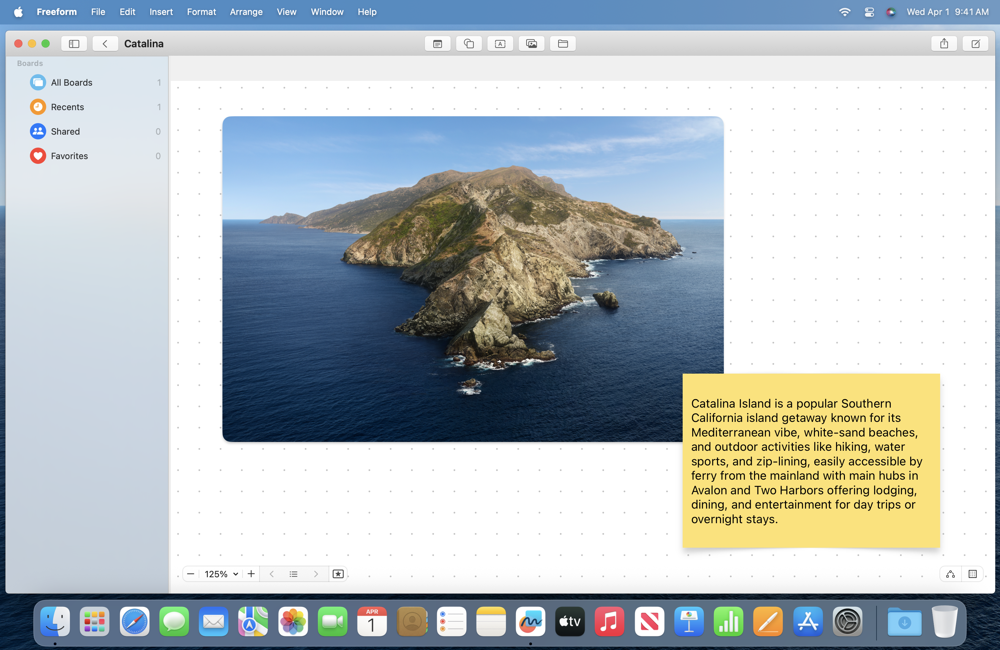
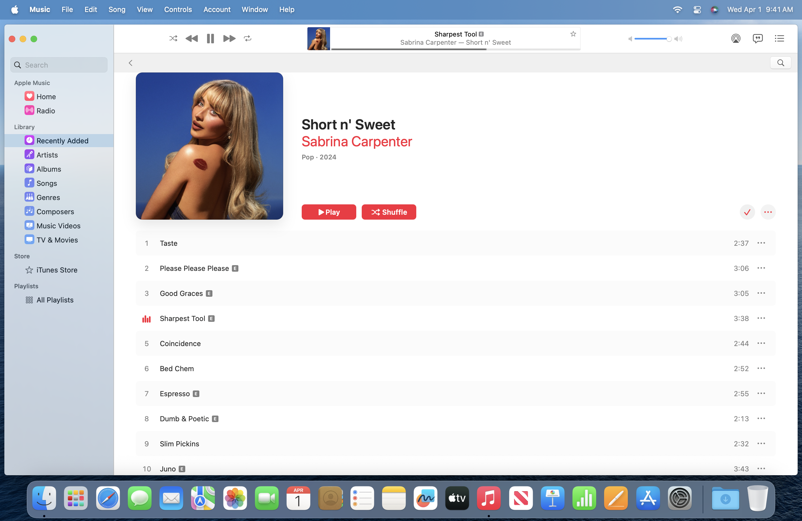
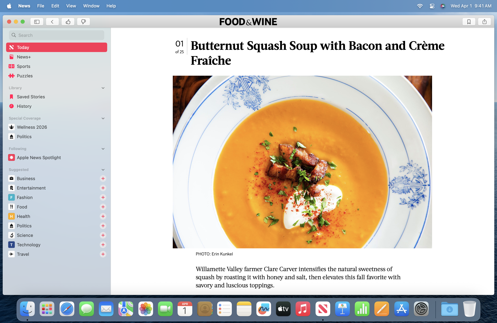
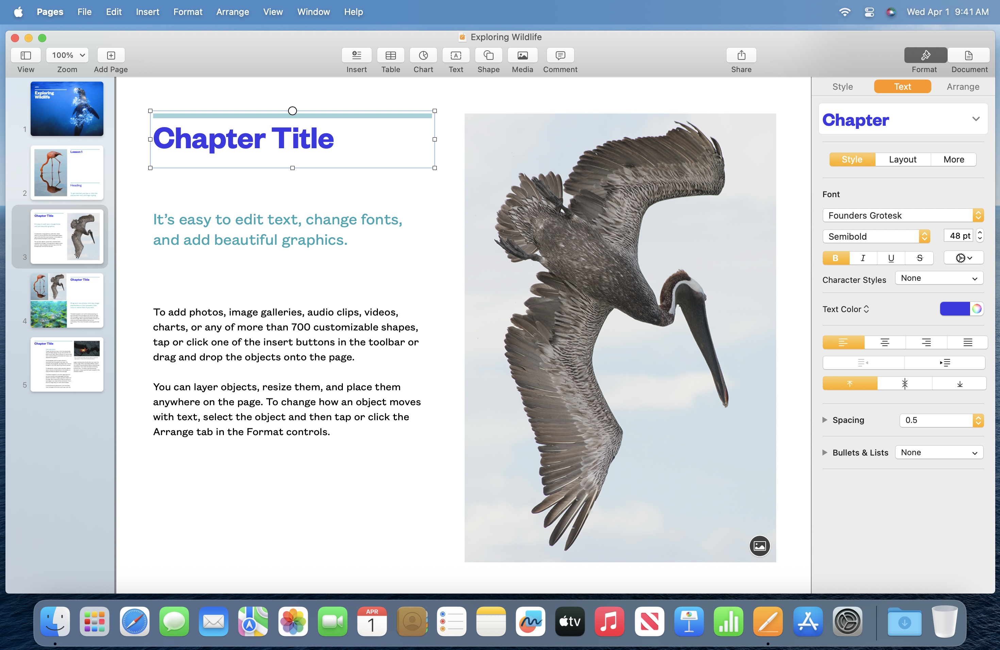

# BackToCatalina Beta

Restores macOS Catalina UI on newer versions of macOS. Works on both Apple silicon and Intel running macOS Tahoe, macOS Sequoia, macOS Sonoma, and macOS Ventura. Support for macOS Tahoe is heavily experimental. Featured on [MacGeneration](https://www.macg.co/macos/2026/01/backtocatalina-propose-de-revenir-linterface-de-macos-1015-sur-les-mac-recents-306269). Contributions are welcome!



## Installing BackToCatalina Beta

1. [Disable System Integrity Protection](https://developer.apple.com/documentation/security/disabling-and-enabling-system-integrity-protection) by running `csrutil disable` in macOS Recovery
1. Install [ammonia](https://github.com/CoreBedtime/ammonia?tab=readme-ov-file#quick-install)
1. Install [BackToCatalina.pkg](https://raw.githubusercontent.com/nfzerox/BackToCatalina/refs/heads/main/BackToCatalina.pkg) and reboot

Installing BackToCatalina Beta on macOS Tahoe causes Dock, Control Center, and Notification Center to appear without any background material. To fix this, install [launchbad-revived](https://github.com/nfzerox/launchbad-revived).

If an app has compatility issue with BackToCatalina, add the executable name to the end of `/private/var/ammonia/core/tweaks/libBackToCatalina.dylib.blacklist`

## Uninstalling BackToCatalina Beta
In Terminal, run the following and reboot:
```
launchctl unsetenv FEATUREFLAGS_DISABLED
sudo rm -rf /private/var/ammonia/core/tweaks/libBackToCatalina*
sudo defaults delete /Library/Preferences/FeatureFlags/Domain/SwiftUI.plist
```

## Contributing to BackToCatalina Beta
If you're a developer, it's easy to make contributions. To get started, clone this repo and build BackToCatalina in Xcode. This automatically generates an updated `BackToCatalina.pkg` installer at the project directory which you can install and test. To build a universal installer for Apple silicon and Intel, change the destination from "My Mac" to "Any Mac".

To iterate changes and fixes more quickly, choose Product > Schemes > Edit Scheme > Run, and change the Build Configuration from Release to Debug. Then open Terminal and run:
```
sudo chmod -R a+rwx /private/var/ammonia/core/tweaks
```

After this, building BackToCatalina in Xcode automatically updates the installed `libBackToCatalina.dylib`. When using the Debug build configuration, other assets such as `libBackToCatalina.dylib.blacklist` and `SystemAppearance.bundle` must be updated manually.

## Screenshots

<p align="center">Finder</p>


<p align="center">Safari</p>


<p align="center">Mail</p>


<p align="center">Maps</p>


<p align="center">Calendar</p>


<p align="center">Notes</p>


<p align="center">Freeform</p>


<p align="center">Music</p>


<p align="center">News</p>


<p align="center">Keynote</p>


<p align="center">Numbers</p>


<p align="center">Pages</p>
